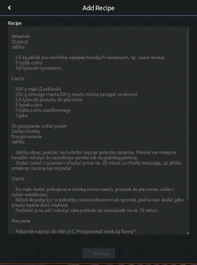
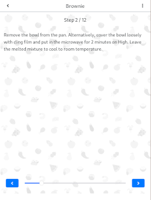

# Twili Recipes

Recipes done **The Way I Like It**. 

Simple app to help you with cooking.

Twili is not just a recipe manager. It's a cooking assistant app focusing 
mainly on ease of use. It's main features include:

- Use LLM to automatically parse recipes - simply copy and paste recipes from any website (or write them yourself)
- NextCloud integration to to easily share recipes between devices
- Multiplatform support (desktop and mobile)
- Unique recipe presentation to save you a lot of scrolling 

This project is still under development. 

It currently supports NextCloud and local device for storage. 
ChatGPT LLM is supported.
Other cloud and LLM service can be easily added. 





### Download

[](https://f-droid.org/packages/net.curiana.recipes/)

Installers are also available at [Github](https://github.com/kandrelczyk/twili-recipes/releases/latest).

### Supported LLMs

All supported LLMs handle recipe translation without major issues. Known edge cases are:
1. Ingredients with the same name: gpt-4 will sometimes correctly recognize and differentiae multiple instances of the same ingredient. 
2. Different grammatical forms of ingredient names in some languages: gtp-3.5 will align grammatical forms to correctly display the quantity in the step description 
When using other models fixing those issues may require manual editing. 

gpt-4-turbo is the best performing LLM but it's significantly slower and more expensive than other models.
gpt-3.5-turbo doesn't handle all the cases but is faster and less expensive. 
Perplexity is the least expensive LLM with very good performance.

Translation of a single recipe costs fractions  of a cent so in practice, cost of services is as follows:

- Perplexity: $3 indefinitely 
- ChatGPT: $5 per year
- Claude: $5 per year

## Free

Free option uses rate limited OpenAI API. The token is shared between all users so it's not guaranteed to work. 

## ChatGPT

ChatGPT option uses gpt-3.5-turbo or gtp-4-turbo model.

gpt-3.5-turbo handles recipe to JSON translation very well and is significantly cheaper than latest models.
The pricing as of 09/2024 is:

| Input            | Output            |
|------------------|-------------------|
|$0.50 / 1M tokens | $1.50 / 1M tokens |

gpt-4-turbo is the best performing model handling all the edge cases but it's slower and more expensive than gpt-3.5.

The pricing as of 09/2024 is:

| Input            | Output            |
|------------------|-------------------|
|$10 / 1M tokens   | $30 / 1M tokens |

To create the API token sign up for [OpenAI](https://platform.openai.com/signup) account and visit <https://platform.openai.com/api-keys>.
The minimum amount of money that can be added to the balance is $5.
Credits expire after 1 year so in practice using it will cost $5/year. 

## Perplexity 

Perplexity option uses llama-3.1-70b-instruct model. 
The pricing as of 09/2024 is $1 / 1M tokens.

To create the API token sign up for [Perplexity](https://www.perplexity.ai/) account and visit <https://www.perplexity.ai/settings/api>
The minimum amount of money that can be added to the balance is $3.
Credits don't expire. 

## Claude (WIP)

Claude option uses claude-3-5-sonnet-20240620 model. 
The pricing as of 09/2024 is:

| Input            | Output            |
|------------------|-------------------|
|$3 / 1M tokens    | $15 / 1M tokens |

To create the API token sign up for [Claude](https://console.anthropic.com/) account and visit <https://console.anthropic.com/settings/keys>
The minimum amount of money that can be added to the balance is $5.
Credits expire after 1 year so in practice using it will cost $5/year. 


## Building

Follow the typical Tauri setup process for your platform. Install all dependencies listed in prerequisites.

Install trunk (`cargo install trunk`) and tailwindcss (`npm install -g tailwindcss`).

Add wasm target (`rustup target add wasm32-unknown-unknown`)

### Desktop app


Make sure you have tauri-cli updated to the latest version.

Run `cargo tauri dev`

#### note

In case having problems with running `cargo tauri dev`
make sure you have following things installed:
- cargo install tauri-cli@2.0.0-beta.14 --locked
- cargo install trunk
- rustup target add wasm32-unknown-unknown

### Android app

To build the app for Android on Linux insert following into .bashrc:

```
export JAVA_HOME={java home}
export ANDROID_HOME={android home}
export ANDROID_NDK_HOME={android NDK home}

export TOOLCHAIN=$ANDROID_NDK_HOME/toolchains/llvm/prebuilt/linux-x86_64
export TARGET=aarch64-linux-android
export API=33

export AR=$TOOLCHAIN/bin/llvm-ar
export CC=$TOOLCHAIN/bin/$TARGET$API-clang
export AS=$CC
export CXX=$TOOLCHAIN/bin/$TARGET$API-clang++
export LD=$TOOLCHAIN/bin/ld
export RANLIB=$TOOLCHAIN/bin/llvm-ranlib
export STRIP=$TOOLCHAIN/bin/llvm-strip

export PATH=$PATH:$ANDROID_HOME/cmdline-tools/latest/bin
export PATH=$PATH:$TOOLCHAIN/bin
```


Run `cargo tauri android init` and `cargo tauri android dev`

## Integration tests

Install tauri-driver and WebKitWebDriver (https://tauri.app/v1/guides/testing/webdriver/introduction). Build the app using `cargo tauri build`. Run the test using `cargo test`. 


## License

Twili Recipes application is distributed under the Apache 2.0 license. See the [LICENSE](/LICENSE) file for more information.
