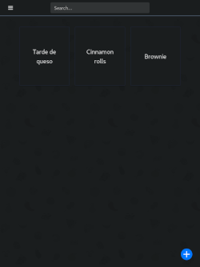

### Twili Recipes

Simple app to help you with cooking.

Twili is not just another recipe manager. It's a cooking assistant app focusing 
maily on ease of use. It's main features include:

- Use LLM to automatically parse recipes - simply copy and paste recipes from any website
- NextCloud integrationto to easily share recipes between devices
- Multiplatform support (desktop and mobile)
- Unique recipe presentation to save you a lot of scrolling 


This project is still under development. 

It currently supports NextCloud and ChatGPT but other cloud and LLM services can be easily added in the future. 




### Building

Follow the typical Tauri setup process for your platform. Install all dependencies listed in prerequisites.

Install trunk (`cargo install trunk`) and tailwindcss (`npm install -g tailwindcss`).

## Desktop app


Make sure you have tauri-cli updated to the latestes version.

Run `cargo tauri dev`

## note

In case having problems with running `cargo tauri dev`
make sure you have following things installed:
- cargo install tauri-cli@2.0.0-beta.14 --locked
- cargo install trunk

## Android app

To build the app for Android on Linux insert following into .bashrc:

```
export JAVA_HOME={java home}
export ANDROID_HOME={android home}
export ANDROID_NDK_HOME={android NDK home}

export TOOLCHAIN=$ANDROID_NDK_HOME/toolchains/llvm/prebuilt/linux-x86_64
export TARGET=aarch64-linux-android
export API=33

export AR=$TOOLCHAIN/bin/llvm-ar
export CC=$TOOLCHAIN/bin/$TARGET$API-clang
export AS=$CC
export CXX=$TOOLCHAIN/bin/$TARGET$API-clang++
export LD=$TOOLCHAIN/bin/ld
export RANLIB=$TOOLCHAIN/bin/llvm-ranlib
export STRIP=$TOOLCHAIN/bin/llvm-strip

export PATH=$PATH:$ANDROID_HOME/cmdline-tools/latest/bin
export PATH=$PATH:$TOOLCHAIN/bin
```


Run `cargo tauri android init` and `cargo tauri android dev`

## Building apk file

Follow instructions at https://next--tauri.netlify.app/next/guides/distribution/sign-android/
You can use the included local.properties and build.gradle.kts template files.

Copy `AndroidManifest_template.xml` to `src-tauri/gen/android/app/src/main/AndroidManifest.xml`.

Copy `local.properties_template` to `src-tauri/gen/android/local.properties`. 

Copy `app_build.gradle.kts_template` to `src-tauri/gen/android/app/build.gradle.kts`.
Don't forget to change namespace and applicationId parameters in the grandle build template. 

### Integration tests

Install tauri-driver and WebKitWebDriver (https://tauri.app/v1/guides/testing/webdriver/introduction). Build the app using `cargo tauri build`. Run the test using `cargo test`. 

